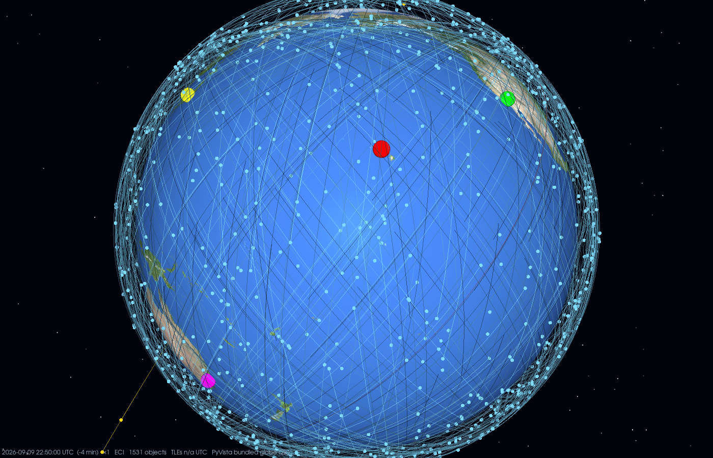

# satviz

Live 3D satellite viewer: CelesTrak TLEs → SGP4 → a globe you can orbit, zoom and scrub through time.



```
git clone https://github.com/dwtrott/satviz.git && cd satviz
pip install -r requirements.txt
```

## Web viewer — `satviz_web.py` (recommended)

Serves a CesiumJS page and hands you a link. Works from a terminal, a local Jupyter kernel, or
Google Colab (see `satviz_colab.ipynb`). Only `requests` is needed on the Python side.

```python
from satviz_web import launch
srv = launch(groups=["stations", "gps-ops", "starlink"])   # → http://localhost:8765/  (Colab: proxied link)
srv.stop()
```
`python satviz_web.py --groups stations gps-ops starlink --port 8765` does the same from a shell;
add `--host 0.0.0.0` to share on your LAN.

- NASA Blue Marble imagery (no API key), day/night terminator, atmosphere, stars
- Left-drag orbit · scroll zoom · right-drag tilt · click a satellite for name / NORAD / alt / lat-lon / speed / period
- Clock widget for playback speed (×1 … ×thousands), timeline for scrubbing ±12 h, "now ×1" to return
- Trails per satellite (length + count sliders), full-orbit line for the selected object, follow mode
- Inertial (ECI) camera toggle so orbits stay put while the Earth turns
- Per-group visibility, find by name or NORAD id, TLEs refetched every 2 h
- Propagation runs in the browser (satellite.js), so 10k+ objects are fine
- Optional: `launch(..., ion_token="…")` or `CESIUM_ION_TOKEN=…` for Cesium ion / Bing imagery

## Desktop window — `satviz_gui.py`

PyVista/VTK window with a Qt control panel, textured Earth and sun lighting. Local machine only.

```python
from satviz_gui import launch
app = launch(groups=["stations", "gps-ops", "starlink"])
```
or `python satviz_gui.py --groups stations gps-ops`. Needs `pyvista pyvistaqt PyQt5 matplotlib`.

## Data layer — `satviz.py`

`Catalog` fetches CelesTrak groups and propagates with vectorised SGP4:
`Catalog().fetch(["gps-ops"]).propagate(times)` → ECI km, shape `(n_sats, n_times, 3)`.
Also contains an inline Plotly `SatelliteViewer` if you ever want it in a notebook cell.

CelesTrak GROUP names: stations, gps-ops, galileo, glo-ops, beidou, starlink, oneweb, iridium-NEXT,
weather, noaa, geo, active (everything), cosmos-2251-debris, …
